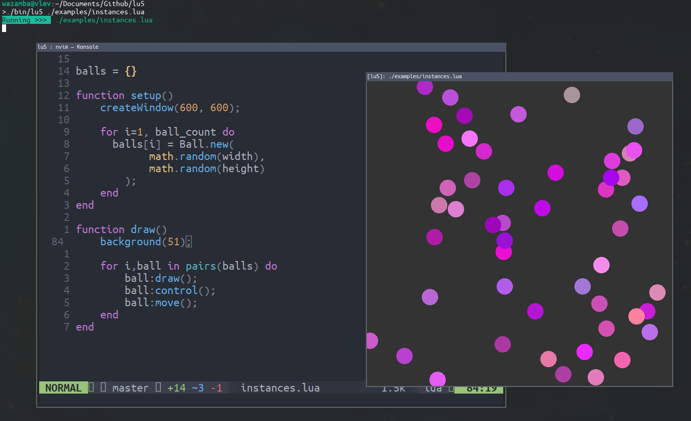

<p align="center">
    
</p>

<h4 align="center">Lua interpreter for Creative Coding</h4>

Provides a similar experience to <a href="https://p5js.org">p5.js</a> with opengl wrappers.

> We are not and we do not claim to be affiliated with p5.js or the processing foundation

<br/>


This sketch draws a circle at position `300, 300`.

```lua
function setup()
    createWindow(600, 600);
end

function draw()
    background(51);

    circle(300, 300, 32);
end
```

<br/>

# Build

You can download a built executable for lu5 [here](https://github.com/matiasvlevi/lu5/releases), or you can build it yourself assuming you have the right dependencies installed (glfw, lua)

### GNU/Linux

Build with `make`

```sh
make
```

you can then install the executable in `/usr/bin`

```sh
sudo make install
```

<br/>

### Windows

Windows builds are done in an [MSYS2](https://www.msys2.org/) environement with mingw64 installed.

Install dependencies

```
pacman -S mingw-w64-x86_64-toolchain mingw-w64-x86_64-lua mingw-w64-x86_64-glfw
```

build

```
make PLATFORM=win
```

<br/>


## Running Lua Sketches

Specify the path of the file you want to execute

```sh
lu5 file.lua
```

--- 

<br/>

### Command utilities


<br>

### Preview




<br>
