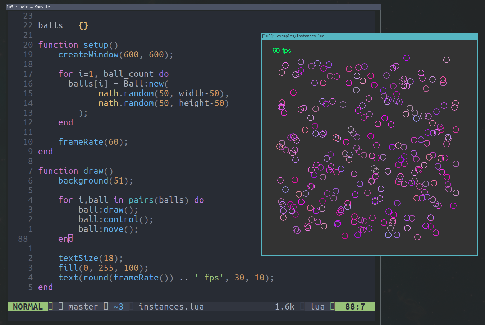
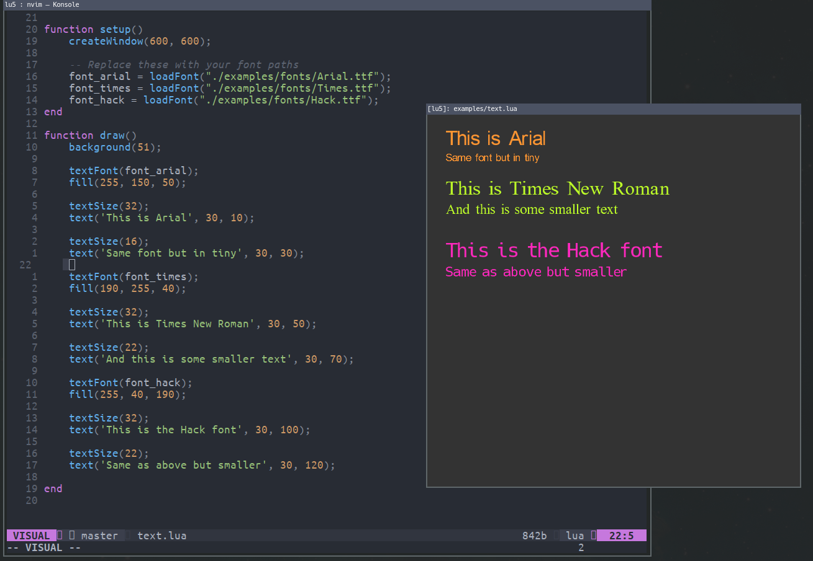

<p align="center">
    
</p>

<h4 align="center">Lua interpreter for Creative Coding</h4>

Provides a similar experience to <a href="https://p5js.org">p5.js</a> with opengl wrappers.

> We are not and we do not claim to be affiliated with p5.js or the processing foundation

<br/>


This sketch draws a circle at position `300, 300`.

See [API Documentation](https://matiasvlevi.github.io/lu5/latest) for more

```lua
function setup()
    createWindow(600, 600);
end

function draw()
    background(51);

    circle(300, 300, 32);
end
```

<br/>

# Build

You can download a built executable for lu5 [here](https://github.com/matiasvlevi/lu5/releases), or you can build it yourself assuming you have the right dependencies installed (opengl, glfw, lua, freetype2).

> If you encounter any problems with your build or runtime, it is encouraged to submit an [issue](https://github.com/matiasvlevi/lu5/issues) and steps to reproduce.

### GNU/Linux

```sh
git clone --recurse-submodules https://github.com/matiasvlevi/lu5
cd lu5
make
```

you can then install the executable in `/usr/bin`

```sh
sudo make install
```

<br/>

### Windows

Windows builds are done in an [MSYS2](https://www.msys2.org/) environement with mingw64 installed.

Install dependencies

```
pacman -S mingw-w64-x86_64-toolchain mingw-w64-x86_64-lua mingw-w64-x86_64-glfw mingw-w64-x86_64-freetype
```

build

```
make PLATFORM=win
```

<br/>


## Running Lua Sketches

Specify the path of the file you want to execute

```sh
lu5 file.lua
```

--- 


<br>

### Preview


<table align="center">

<tr>
<td>

```lua
x = 100
vx = 7;

function setup()
	createWindow(400, 400);
	
	-- Lock fps
	frameRate(60);
end

function draw()
	background(51);
	
	-- render fps
	text('fps: ' .. frameRate(), 20, 10);

	-- render circle
	circle(x, 200, 32);

	-- bounce
	if (x > width-16 or x < 16) then
		vx = -vx;
	end

	-- move
	x = x + vx;
end

```

</td>
<td>


</td>
</tr>

<!-- 

 -->

</table>

<p align="center">
    
</p>
<p align="center">
    
</p>


<br>

---

### Contributions

Contributions to expand the lu5 api are welcomed.

Read the [contribution docs](./CONTRIBUTING.md)
